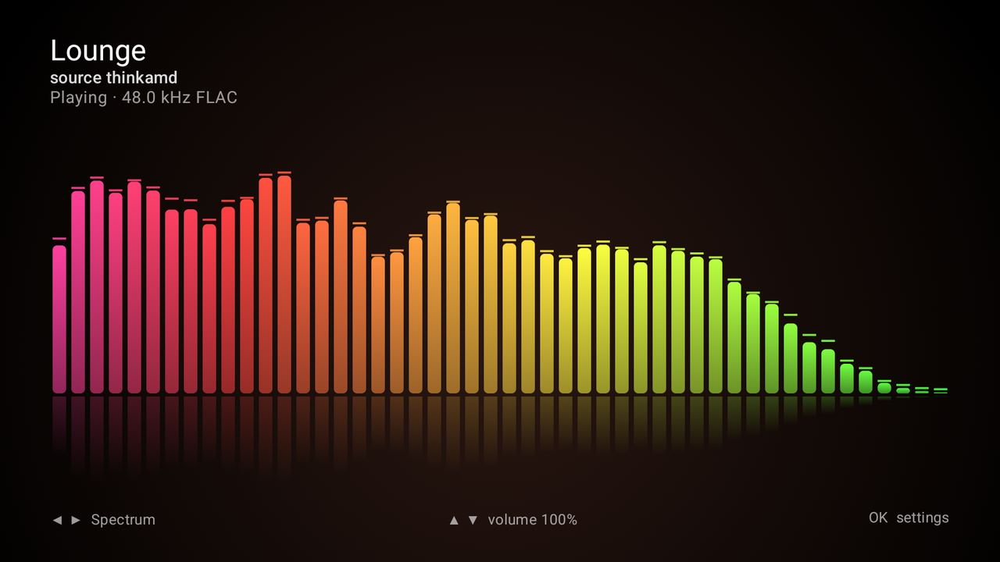
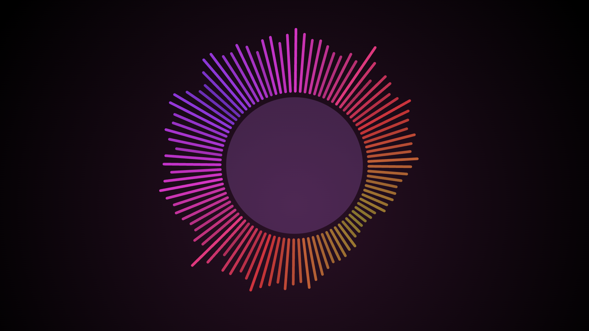
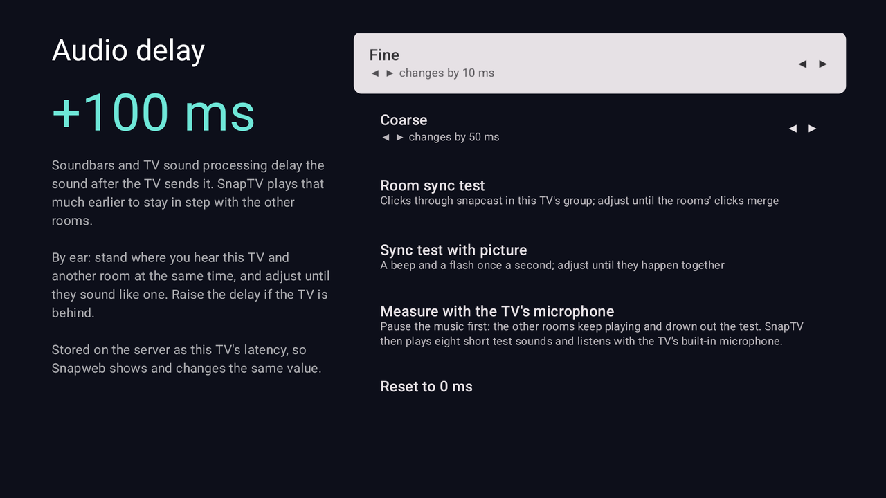
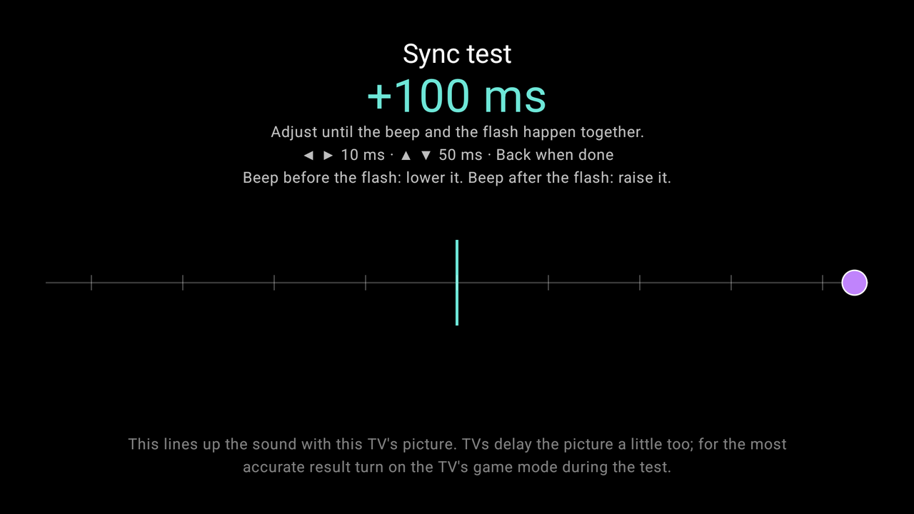

# SnapTV

An Android TV client for [Snapcast](https://github.com/badaix/snapcast) multiroom audio.
Your TV becomes one more synchronised room speaker, and the screen shows a visualizer of
what is playing instead of a blank menu.



| Halo | Oscilloscope |
|---|---|
|  |  |
| **Ridges** | **Starfield** |
|  |  |
| **Pulse** | **Liquid** |
|  |  |
| **Audio delay** | **Sync test with picture** |
|  |  |

- **Built for the remote.** Everything works with the D-pad: ◀ ▶ changes the visualizer,
  ▲ ▼ changes volume, OK opens settings.
- **Remote, touch or mouse.** It also runs on phones, tablets and plain Android boxes: tap
  opens settings, swipe changes visualizer (sideways) or volume (up/down), the mouse wheel
  changes volume, and delay screens get on-screen −/+ buttons. Always landscape.
- **Plays in the background.** Audio runs in a foreground service, keeps going while the TV
  shows other apps, and can start at boot.
- **In sync, including the TV's own delay.** Soundbars (especially over HDMI ARC) and TV sound
  processing delay the sound after Android hands it over, and Android can't see it. Settings →
  *Audio delay* compensates, live while you listen, with three ways to find the value:
  - **Sync test with picture:** a beep and a flash once a second; adjust until they coincide.
  - **Measure with the TV's microphone:** plays test chirps and times them automatically
    (needs a TV with a built-in microphone, switched on).
  - **By ear** against another room, in 10 ms and 50 ms steps.

  The delay is stored on the server as the TV's snapcast latency, so Snapweb shows and changes
  the same value.
- **Visuals that match the sound.** Spectrum, halo and oscilloscope styles are drawn from the
  exact samples being played, timed to when they are *heard*, not when they are decoded.
- **Finds your server.** Discovers snapserver over mDNS (`_snapcast._tcp`), or you can enter
  an address.

## SnapTV Desktop (Linux)

The same room and visualizers on a Linux desktop, full screen on the monitor you choose. Download
`SnapTV-Desktop-<version>-x86_64.AppImage` from Releases, `chmod +x` it and run it. It plays
through PipeWire/PulseAudio and finds snapserver by itself (or `--server HOST`). Keys: ← → style,
↑ ↓ volume, S settings, M next monitor, F11 full screen, Esc leave full screen. Closing the window
keeps it playing from the system tray: the tray icon's menu shows the window again or quits;
`--tray` starts it there. It updates itself from GitHub releases (Settings → Updates), and the
AppImage carries update information for AppImageUpdate and Gear Lever too. Starting it again while it runs just shows the running copy's window. Don't run it next to snapclient
on the same machine, or that room plays twice.

### Send mode

SnapTV Desktop can instead be the *source*: Settings → Mode → *Send this computer's audio*. It
creates a PipeWire output called **Snapcast (multiroom)**; whatever you play into it goes to the
rooms, and the visualizer shows what is being sent. It sends to a tcp input on snapserver, which
needs one in `snapserver.conf`:

```ini
[stream]
source = tcp://0.0.0.0:4953?name=Laptop&mode=server&sampleformat=48000:16:2
```

Audio is sent exactly in real time by the computer's clock (a frame is dropped or repeated now and
then to absorb clock drift), so no delay builds up at the server over time. If the output goes
away or PipeWire restarts, it recreates the output and reconnects. One mode at a time: a computer
either plays a room or sends. Linux only.

## Installing

Download `snaptv-<version>.apk` from [Releases](https://github.com/thinke/snaptv/releases) and
sideload it onto the TV with `adb install snaptv-<version>.apk`, or with a file-transfer app on
the TV. Open SnapTV once. It finds snapserver on your network and starts playing.

SnapTV checks GitHub for new releases whenever it is opened and once a day, and offers to install
them (Settings → Updates). Downloads are checked against the published SHA-256 and must be
signed with the same key; Android asks before installing. The first time, Android also asks
you to allow SnapTV to install apps.

To use the visualizer as the screensaver, pick *SnapTV visualizer* under Settings → System →
Ambient mode / Screen saver. Some Google TV builds hide third-party screensavers; there you can
set it with
`adb shell settings put secure screensaver_components io.github.thinke.snaptv/.VisualizerDream`.

## How it works

SnapTV is a small, pure Kotlin reimplementation of the snapclient side of the protocol. It
does not wrap the native snapclient binary.

| Piece | Where | Notes |
|---|---|---|
| Binary protocol | `core/…/protocol` | Hello, Time, ServerSettings, CodecHeader, WireChunk, ClientInfo |
| Clock sync | `core/…/sync/TimeSync.kt` | Median of `(c2s − s2c) / 2` over recent round trips |
| Decoders | `core/…/codec`, `app/…/MediaCodecDecoders.kt` | FLAC (own decoder, checked against libFLAC's MD5) and PCM in core; Opus and Ogg/Vorbis through Android's MediaCodec, with the Ogg demuxing and codec headers done in core |
| Sync buffer | `core/…/sync/SyncBuffer.kt` | Sample-exact start, hard resync on jumps, ±500 ppm drift correction by dropping or duplicating single frames |
| Audio output | `app/…/AudioOutput.kt` | AudioTrack. The DAC time of each block is extrapolated from `AudioTrack.getTimestamp`. |
| Visualizer | `core/…/visual`, `app/…/ui/Visualizer.kt` | FFT spectrum; samples pulled at the time they are heard |
| Control API | `core/…/control/ControlClient.kt` | JSON-RPC: room, group, source and track names; switch source, rename |
| Screensaver | `app/…/VisualizerDream.kt` | The visualizer as the TV's screensaver (DreamService) |

The `core` module has no Android dependencies, so it is unit tested on the JVM. The `cli`
module is a desktop test client that exercises it against a real server.

Codecs: `flac`, `pcm`, `opus` and `ogg` (Vorbis) in the app. Settings → Decoders picks the
decoder per codec: SnapTV's own (FLAC, PCM), FFmpeg (FLAC; the bundled FFmpeg build has no Opus
or Vorbis decoder) or any of the device's MediaCodec decoders; *Test decoders on this device*
checks them all (bit-exact FLAC, tone and level for the lossy codecs, speed and delay). The desktop `cli` has no
MediaCodec, so there `opus` and `ogg` are reported as unsupported.

## Building

Requires JDK 17+ and the Android SDK (compileSdk 37).

```sh
./gradlew :core:test            # protocol, codec and sync tests
./gradlew :app:assembleDebug    # app/build/outputs/apk/debug/app-debug.apk
adb install -r app/build/outputs/apk/debug/app-debug.apk
```

Desktop test client (connects, keeps sync, prints statistics, and can dump what it would
play to a WAV file):

```sh
./gradlew :cli:installDist
cli/build/install/cli/bin/cli <server> [--seconds 10] [--wav out.wav] [--play]
```

## Releases

Pushing a `v*` tag runs `.github/workflows/release.yml`, which tests, builds a signed APK and
publishes a GitHub release. It needs these repository secrets: `SNAPTV_KEYSTORE_BASE64`,
`SNAPTV_KEYSTORE_PASSWORD`, `SNAPTV_KEY_ALIAS`, `SNAPTV_KEY_PASSWORD`. Local signed builds read
the same values from the environment (`SNAPTV_KEYSTORE` is a path).

## Known limitations

- Android 15+ does not allow media playback services to start from `BOOT_COMPLETED`, so
  there *Start when the TV boots* has no effect and playback starts when the app is opened.
- TCL TVs block apps from starting at boot or after an update until they are given TCL's
  auto-start permission (in the TV's settings, often *Apps → Special app access → Auto-start*,
  or `adb shell appops set io.github.thinke.snaptv APP_AUTO_START allow`).
- Output is 16-bit. 24/32-bit streams are down-converted.
- Opus and Vorbis depend on the TV's MediaCodec decoders. If a decoder falls over mid-stream
  it is restarted at the next chunk, which costs a short gap; if it keeps failing, the
  connection shows as failed with the decoder's error and is retried.
- With Vorbis, the first chunk after connecting or a stream change plays up to about 21 ms
  early (the decoder outputs nothing for its first packet), as with snapclient. The sync
  buffer then corrects it. Opus is decoded without
  pre-skip, exactly as snapclient does, so it stays in step with snapclient rooms.

## License

Copyright © 2026 Jyri Loukola

SnapTV is free software: you can redistribute it and/or modify it under the terms of the
GNU General Public License as published by the Free Software Foundation, either version 3 of
the License, or (at your option) any later version. It is distributed in the hope that it will
be useful, but WITHOUT ANY WARRANTY; without even the implied warranty of MERCHANTABILITY or
FITNESS FOR A PARTICULAR PURPOSE. See [LICENSE](LICENSE) for the full text.

SnapTV is an independent client for [Snapcast](https://github.com/badaix/snapcast) and is not
affiliated with the Snapcast project.
